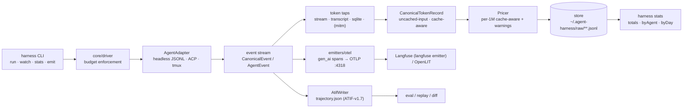

# agent-harness — Architecture

> **STATUS (2026-09-09):** written against the actual `src/` tree (`core/`, `adapters/`, `cli/`,
> `emitters/`, `monitors/`). Items that exist only by name are marked `[planned]` (the kiro
> adapter and its MITM tap shipped; see §2). Known cross-file interface conflicts are flagged `⚠` and listed in the build report
> to the orchestrator — this doc describes the interfaces as they stand, not as they should be.

agent-harness is a headless-first orchestration and observability layer over coding-agent CLIs
(Claude Code, Codex CLI, OpenCode, Gemini CLI, Kiro). One harness, many agents: normalized events,
cache-aware token accounting, persisted trajectories, and live dashboards — without giving up each
agent's native strength.

## 1. Adapter pattern

The adapter contract lives in `src/adapters/types.ts`:

```ts
interface AgentAdapter {
  readonly id: string;
  readonly capabilities: AdapterCapabilities;   // headless · streaming · resume · acp · tmuxFallback
  spawn(prompt: string, opts?: RunOptions): RunHandle;
  resume(sessionId: string, prompt: string, opts?: RunOptions): RunHandle;
}
interface RunHandle {
  events: AsyncIterable<CanonicalEvent>;        // completes when the child exits
  wait(): Promise<number>;                      // child exit code
  abort(): void;                                // SIGTERM → SIGKILL after grace
}
```

`AgentCapabilities` makes the lane hierarchy explicit per CLI (`acp: true` on gemini today;
`tmuxFallback: true` on all shipped adapters).

Three driving lanes, in strict preference order:

1. **Headless-first (primary lane, implemented).** Every shipped adapter drives the CLI's
   non-interactive JSONL mode: `codex exec --json` (`adapters/codex.ts`), `gemini -p --output-format
   stream-json --approval-mode yolo` (`adapters/gemini.ts`), Claude `--output-format stream-json`
   (via the transcript tap until `adapters/claude.ts` lands). Lessons from running agents under
   Harbor apply: headless is the only lane that is reproducible, diffable, and parallelizable.
2. **ACP (emerging universal layer).** ACP-speaking agents collapse into one adapter — one event
   parser, one token tap. The capability flag tracks which CLIs are ready; new agent support
   checks ACP first.
3. **tmux fallback lane (implemented, `monitors/tmux-driver.ts`).** For TUI-only situations:
   `TmuxDriver` starts a detached session, sends the task with `send-keys -l` + a discrete Enter
   (the claude-squad mid-paste-submit lesson), captures the pane, and pipes raw output to a log.
   This lane is lossy — its token readout is the `TokenScraper` status-line approximation, never
   billing-grade.

All lanes converge on normalized events. The stream plumbing is shared: `adapters/shared.ts`
provides `runJsonlCli` (spawn → `LineAssembler` → `parseLine` → `EventQueue`), with an injectable
`SpawnFn` so tests replay recorded NDJSON fixtures through production plumbing.

### Canonical events

`CanonicalEvent` (`adapters/types.ts`) is what adapters emit:
`session | message(role,text,reasoning?) | tool(phase start|result, toolName, toolCallId, status?) | usage{tokens: CanonicalTokenRecord} | progress | error`.

`AgentEvent` (`core/types.ts`) is the core/domain event model the emitters consume:
`session_start | message{source,content,reasoningContent?} | model_call_start | model_call_end{usage?}
| tool_call{toolCallId,functionName,arguments} | tool_result{toolCallId,content,isError?} | usage{usage} | session_end`.
⚠ Two event vocabularies currently coexist (see §9 merge note).

### Driver

`core/driver.ts` (`createDriver`) is the run orchestrator: resolves the adapter from a registry
(`defaultAdapters()` lazy-imports `adapters/{claude,opencode,kiro,codex,gemini}.js`, skipping
missing ones with a warning), attaches to the event stream, writes a raw NDJSON transcript under
`<stateDir>/raw/`, normalizes usage through `normalizeUsage`, prices each record via the `Pricer`,
and enforces budgets — `budget.usd` aborts mid-run with `exitStatus: "budget_exceeded"`;
`budget.maxTurns` aborts with `"turn_limit"` when the adapter doesn't enforce it itself
(`adapter.enforcesBudget`). Driver enforcement verdicts override the adapter's own exit verdict.

## 2. Token taps

Usage exists in different places per agent; four collection points all feed the same normalizers
(`core/normalize.ts` exposes `normalizeUsage(agent, raw)` — per-agent extractors, null on
mismatch, never fabricated zeros):

| Tap | Reads today | Where |
|---|---|---|
| Headless stream parsing | native JSONL lines mapped by each adapter's `parse*Line`; usage payloads re-normalized by `core/normalize.ts` (`normalizeClaude`, `normalizeOpencode`, `normalizeCodex`, `normalizeGemini`, `normalizeKiro`) | `src/adapters/*.ts`, `src/core/normalize.ts` |
| Transcript files | Claude Code transcripts tailed byte-exactly by offset (`cli/lib.ts extractClaudeRecordFromLine`; `cli/harness.ts watch` grows-only over `~/.claude/projects/**/*.jsonl`) | `src/cli/lib.ts` |
| Agent SQLite | opencode's local store via `statsFromDb` (stub: schema probe returns `[]` until the real mapping lands; `bun:sqlite` readonly) | `src/adapters/opencode.ts` |
| kiro MITM | `KiroAdapter.launch()` auto-starts `mitmdump` with the inline EventStream addon (default: on when `mitmdump` is on PATH — probe cached; explicit `mitm` option overrides), binds the first free port in 8900-8999, routes kiro-cli through `HTTPS_PROXY`/`SSL_CERT_FILE` (`tapEnv`), and interleaves the tap's records with stdout events; metering credits land in `extra.credits` (metering units, **not USD** — never priced), token counts stay on the stdout usage events (tap events carry zeros). Parser handles both the pre-2.10 `tokenUsage` wire shape and the 2.21 AWS EventStream frames. Degrades gracefully (stderr warning, untapped run) when `mitmdump` is missing or no port binds | `src/monitors/kiro-mitm.ts`, `src/adapters/kiro.ts` |
| LiteLLM proxy `[planned]` | model-agnostic spend ledger for calls routed through it | — |

Rule: **tap one layer per run.** Others are reconciliation sources, never additive
(`docs/TOKEN-COUNTING.md` §2 for the double-counting traps). The kiro MITM tap is
the exception that proves the rule safe: its events carry zero token counts, so the
stdout usage events remain the single token source — the tap adds only the credits
dimension (`extra.credits`, summed by `harness run` into the `credits` summary line).

## 3. Canonical token record

The canonical shape is `CanonicalTokenRecord` — cache-aware, with the uncached-input convention.
⚠ Two variants currently coexist (flagged to the orchestrator):

- `core/normalize.ts` records (the stream-tap output): `{agent, model, inputTokens, outputTokens,
  cacheReadTokens, cacheWriteTokens, reasoningTokens?, timestamp}` — **`inputTokens` is
  uncached-only by convention**; codex/gemini entries are adjusted at extraction time
  (`input − cached`).
- `core/types.ts` `CanonicalTokenRecord` (the domain shape consumed by emitters): optional
  `{promptTokens, completionTokens, cachedTokens, cacheReadTokens, cacheWriteTokens,
  reasoningTokens, costUsd, extra}`.

`sumTokens()` sums each class exactly once; `reasoningTokens` is informational (a subset of
output for providers that bill it inside output). No stored grand total: dashboards derive
`input + cacheRead + cacheWrite + output`, because the correct derivation is provider-dependent.

Cost: `core/pricing.ts` — cache-aware per-1M pricing with an embedded fallback table
(claude-sonnet-4/opus-4, gpt-5, gemini-2.5-pro), LiteLLM-style external map loading (accepts
per-1M or per-token fields), and `resolveAlias` (strips provider prefixes, date stamps,
`-latest/-preview`). Unknown model → `NaN` + a drained warning, **never a silent 0**. The CLI's
transcript tap uses the simpler `cli/lib.ts estimateCostUsd` prefix table when a row carries no
`costUSD` of its own.

## 4. ATIF as persisted artifact

`emitters/atif.ts` implements the ATIF trajectory (`ATIF-v1.7`) as a writer:

- `AtifWriter.startTrajectory({agent, version, modelName})` → `addStep(...)` → `finalize(path)`
  writes `trajectory.json`; `toTrajectory()` returns the document.
- `AtifWriter.fromEvents(events, opts)` converts a harness event stream: `message` events become
  steps, `tool_call`/`tool_result` become step `tool_calls` + `observation.results` (joined by
  `tool_call_id`), `usage`/`model_call_end` accumulate into step `metrics` and `final_metrics`.
- `AtifWriter.validate(path)` checks structural invariants: `step_id` ordering and that every
  observation result references a known `tool_call_id`.
- `addSubagent()` nests child trajectories under `extra.subagents`.

The CLI also exposes `harness emit --input events.json --format atif|otel [--out path]`, which
today routes through the `core/emitters.ts` envelope stub (`schemaVersion: "atif/0.1"`). ATIF is
the durable per-run artifact for eval, replay, and diff.

## 5. OTel gen_ai spans as live transport

`emitters/otel.ts` maps a run to OpenTelemetry spans using `gen_ai.*` semantic conventions:

- Root span `invoke_agent <agent>` with `gen_ai.agent.name`, `gen_ai.conversation.id`,
  `gen_ai.request.model`.
- Child `chat <model>` spans per usage event with `gen_ai.usage.input_tokens`,
  `gen_ai.usage.output_tokens`, `gen_ai.usage.cache_read.input_tokens`
  (`cachedTokens + cacheReadTokens`), `gen_ai.usage.cache_write.input_tokens`,
  `gen_ai.usage.reasoning.output_tokens`.
- Child `execute_tool <fn>` spans from `tool_call` → matching `tool_result` timestamps.

Two paths: `deriveSpans`/`toOtlpJson` are pure (testable, proto-JSON shape); `emitRun` exports
through a real tracer, and `createTracer` wires a `NodeTracerProvider` +
`BatchSpanProcessor(OTLPTraceExporter)` at `http://localhost:4318/v1/traces` by default. Spans
are fire-and-forget live transport — the SQLite ledger and ATIF file remain the source of truth.

## 6. State detection manifests

`monitors/tmux-driver.ts` classifies pane text with declarative rule manifests — data, not code:

```ts
type AgentState = 'running' | 'waiting' | 'idle';
interface DetectionRule {
  state: AgentState;
  pattern: RegExp;              // no /g flag — rules re-test every poll
  region?: 'bottom' | 'anywhere';
  priority: number;             // higher wins; ties → earlier-listed rule
}
```

`StateDetector.detect(paneText)` scores all rules over the bottom region (last 4 non-empty lines)
or the whole pane, first-priority wins, no match → `idle`. Shipped manifests: `CLAUDE_RULES`
(permission box outranks "esc to interrupt" because a mid-run prompt can still show it),
`OPENCODE_RULES`, and a deliberately broad `KIRO_RULES` to refine from `pipeTo` logs.
`watchLoop` polls (2s default), dedupes consecutive identical states, and fires `onChange` on
transitions; the `TokenScraper` sums the TUI's `↓/↑ … tokens` readouts as an approximate,
explicitly not billing-grade figure.

## 7. Sinks and storage

- **ATIF file** — durable per-run artifact (§4).
- **OTel spans** — live OTLP transport (§5); any OTLP endpoint works as a sink, e.g. an OpenLIT
  collector `[planned wiring]`.
- **Langfuse** — verified live sink (`emitters/langfuse.ts`). `emitToLangfuse()` reuses the §5
  `toOtlpJson()` gen_ai payload, layers the `langfuse.*` namespace on top, and POSTs OTLP/HTTP
  JSON to `{baseUrl}/api/public/otel/v1/traces` with Basic auth (pk:sk) and
  `x-langfuse-ingestion-version: 4` (real-time ingest onto the v4 data model). Mapping: every
  span carries `langfuse.session.id`; the root `invoke_agent` span becomes a `span`-typed
  observation + trace name; chat spans become `generation` observations with
  `langfuse.observation.model.name` (usage record's model, falling back to `--model`) and
  `langfuse.observation.usage_details` — Langfuse's mutually-exclusive bucket contract
  (`input` EXCLUDES cache slices; `cacheReadTokens` → `cache_read_input_tokens`,
  `cacheWriteTokens` → `cache_creation_input_tokens`; `total` is derived server-side as the
  bucket sum); `langfuse.observation.cost_details` `{total: costUsd}` when the record carries
  cost; tool spans stay `span`-typed with the tool name in `gen_ai.tool.name`. CLI:
  `harness emit --format langfuse --input <events.json> --langfuse-url/--langfuse-public-key/
  --langfuse-secret-key` (env fallbacks `LANGFUSE_URL`/`LANGFUSE_HOST`, `LANGFUSE_PUBLIC_KEY`,
  `LANGFUSE_SECRET_KEY`). Verified live against a local Langfuse v4 docker-compose instance:
  ingest + `GET /api/public/traces` read-back of the trace, generations, and usage buckets.
- **State store** (`core/store.ts`, JSONL not SQLite): root at `~/.agent-harness`
  (`AGENT_HARNESS_STATE_DIR` overrides). Canonical records append to `<stateDir>/raw/<agent>/<sessionId>.jsonl`;
  `harness watch` keeps byte offsets in `offsets.json` so restarts resume without replay;
  `readAllRecords` powers `harness stats` (`aggregate()` → totals/byAgent/byDay buckets).

## 8. Data flow



CLI → driver → adapter → events; events fan out to the ATIF file, OTel spans, and the normalized,
priced token record in the JSONL state store; dashboards and `stats` read the sinks or the store.

## 9. Known interface conflicts (for the merge, not for readers of this doc)

Flagged `⚠` above; full list in the build report: dual `AgentEvent` vocabularies (core vs
adapters vs cli/lib formatter), dual `CanonicalTokenRecord` shapes (normalize vs core/types vs
store schema), dual emitter trees (`core/emitters.ts` stub vs `emitters/{atif,otel}.ts`), driver's
`launch`-style adapter registry vs `adapters/types.ts` `spawn`-style contract, and
`cli/harness.ts` importing `AGENTS`/`HarnessError`/`isKnownAgent`/`RunResult` that
`core/types.ts` does not yet export.
